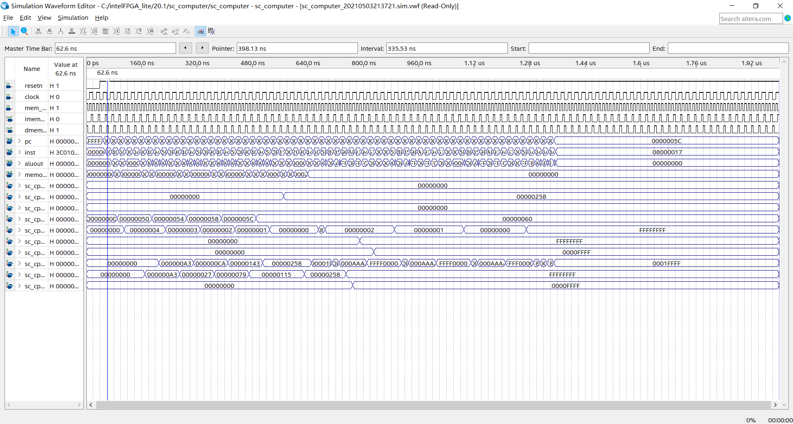
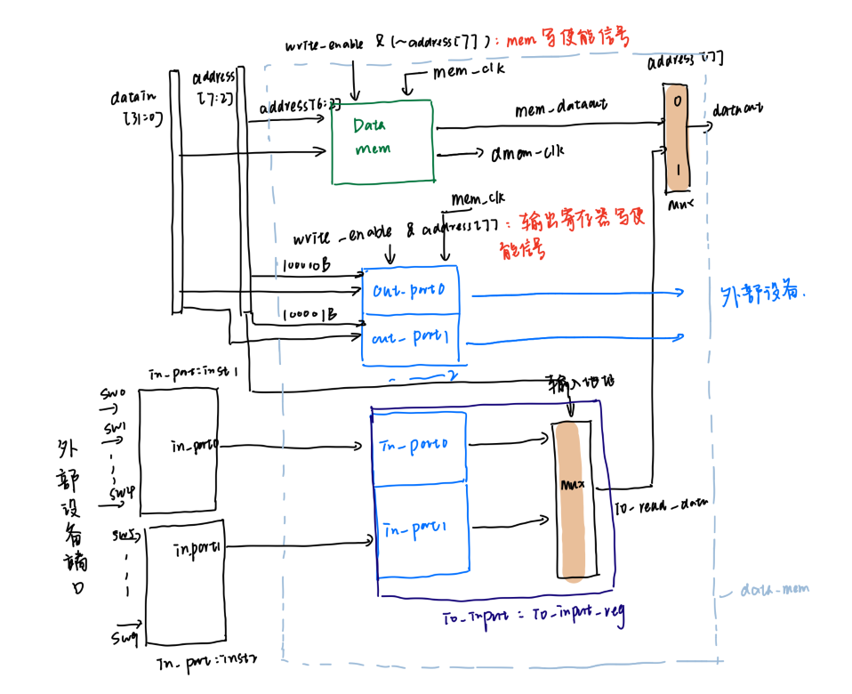
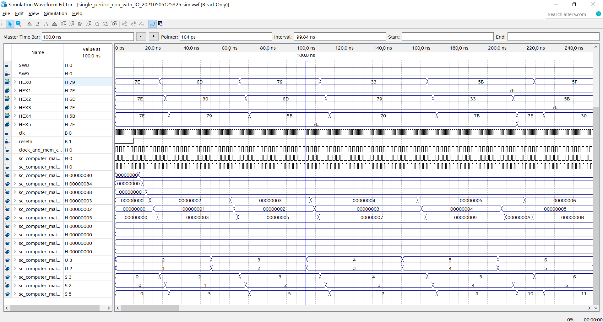
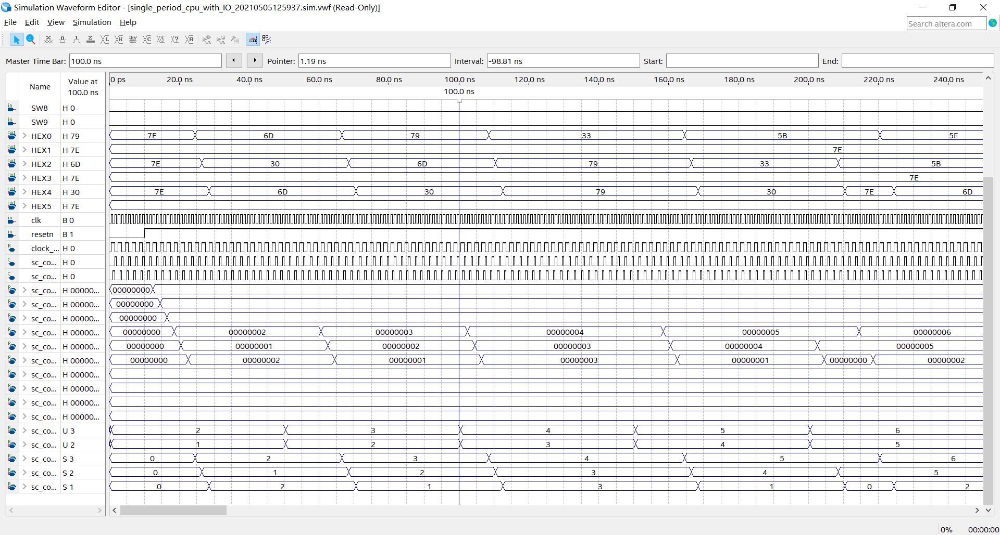

# MIPS  CPU 

SJTU E1332的课程作业，用Verilog语言实现一个支持20条mips指令的小型cpu，实现过程为：单周期CPU -> 单周期带I/O口 CPU -> 五级流水CPU。

大部分代码老师都已经给出，由于个人水平实在有限，所以借鉴了很多往届的作业。

### 单周期CPU

------

实验主要目的是理解20条mips指令的含义 并熟悉CPU的译码过程，源码对应到single_cycle_cpu目录下，顶层文件为sc_computer.v

#### 主要细节：

主要需要更改的是alu.v 文件以及sc_cu.v文件。.mif文件的配置路径可能也需要改一下（如果没改编译器会自动报错提示你改），上面两个文件主体内容老师已经填好，只要对照课本填下机器码即可。

**`ALU`模块：**

| ALU操作 | aluc |         指令         |
| ------- | ---- | :------------------: |
| ADD     | x000 |      add, addi,      |
| SUB     | x100 |         sub          |
| AND     | x001 |      and, andi,      |
| OR      | x101 |       or, ori        |
| XOR     | x010 | xor, xori, bne, beq, |
| LUI     | x110 |         lui,         |
| SLL     | 0011 |         sll          |
| SRL     | 0111 |         srl          |
| SRA     | 1111 |         sra          |

i.e 其中beq\bne指令只要对两个源操作数做异或运算，并比较结果是否为0即可

**`sc_cu`模块**

一方面需要将指令的机器码译码，其中几个输出信号的含义如下：

- `aluimm` =1: 使用imm   0: 不使用imm
- `sext` = 1: 做符号位扩展 0: 不做符号位扩展
- `wmem ` = 1: 写入内存 0: 不写入内存
- `m2reg  `=1: 从内存中取数写入寄存器
- `regrt` = 1: 选择rt作为目标写入寄存器 0: 选择rd作为目标写入寄存器
- `jal` =1: jal指令 0：其他指令  

另一方面需要将某些指令映射到对应的alu操作，主要参考上面的表格即可。

#### 仿真结果

### 单周期带I/O口 CPU

------

第二个实验需要改动的地方较多，有些内容老师提示的也较少，因此参考了部分往届代码。

在老师给的cpu结构图上做了一些修正：

  

实验主要过程如下：

- 重新编写datamem，为其增加io_output和io_input子模块，使其可以根据address[7]区分选择mem_dataout或io_read_dataout作为输出
以及选择io_output寄存器或datamem进行写入。
- 编写clock_and_mem_clk，对输入的主时钟信号main_clk，进行二分频（二分频详细原因可查看实验指导1最后的解释）。
- 编写文件sc_computer_main，对上述进行封装
- 编写input_port和output_port，模拟外部i/o口，并编写sc_computer封装input_port，output_port和sc_computer_main，实现带i/o口的单周期cpu。

#### 为io_output添加resetn信号

只要在io_output.v文件下添加resetn输入端口即可，代码比较简单，在此就省略了。

#### 添加指令（cont): 计算两个数的汉明距离，并进行仿真

主要分为四个步骤：

- 在alu模块内添加汉明距离的计算和对应的aluc; (我直接将其设定为6'h09)
- 在sc_cu模块内添加i_cont的译码过程，并将其映射到对应的alu运算。
- **修改 instmem.wif**，我直接将add指令的机器码调整为cont指令，因此每个loop内从add运算修改为进行cont运算。
- 重新进行波形激励仿真。

### 波形仿真结果

------
#### 原始汇编码：

#### 增加一条指令（cont）,修改add为cont，重新得到波形仿真结果：

观察三个输出端口，可以看到，out_port2对应的输出已经更改为out_port0和out_port1的汉明距离。

(**note**: 在一开始的版本中，我将`alu`中汉明距离的计算写成了一个for循环，但这样ModelSim仿真会报错，报错原因是超过迭代次数限制，
但改成(a[0]^b[0])+...(a[31]^b[31])后报错消失，但实际上这两种写法复杂度一样，只是迭代次数不同，可能是仿真软件还有一些不太灵敏的地方。)
